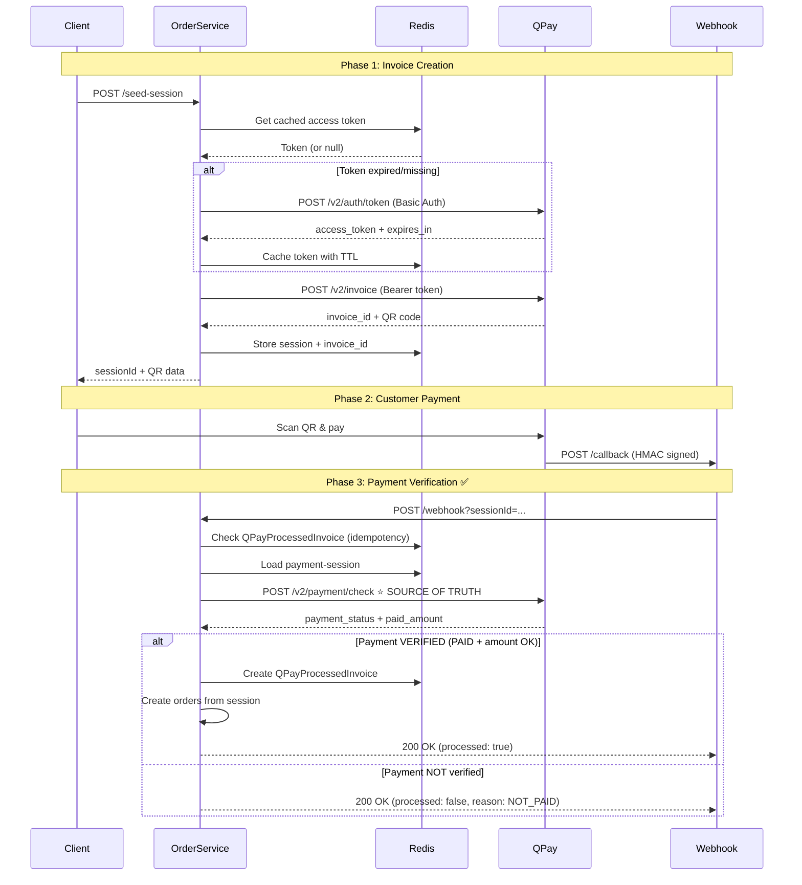

# QPay Integration - Complete Implementation Summary

This document provides a comprehensive overview of the QPay payment integration implementation.

## 📚 Documentation Index

1. **[QPAY_V2_TOKEN_IMPLEMENTATION.md](./QPAY_V2_TOKEN_IMPLEMENTATION.md)**

   - Redis-based access token caching
   - Stampede protection with distributed locking
   - Multi-instance safe token refresh

2. **[QPAY_INVOICE_CREATION_IMPLEMENTATION.md](./QPAY_INVOICE_CREATION_IMPLEMENTATION.md)**

   - Invoice creation flow
   - QR code generation
   - Session management in Redis

3. **[QPAY_PAYMENT_VERIFICATION.md](./QPAY_PAYMENT_VERIFICATION.md)** ⭐

   - **Payment verification via QPay API (source of truth)**
   - Webhook security and validation
   - Idempotency implementation

4. **[QPAY_DATABASE_PERSISTENCE.md](./QPAY_DATABASE_PERSISTENCE.md)** 🔥

   - **Database fallback for Redis expiry**
   - Resilient order creation (100% reliable)
   - Session persistence in MongoDB
   - Works even if customer pays late

5. **[QPAY_STATUS_ENDPOINT.md](./QPAY_STATUS_ENDPOINT.md)** 🔥

   - **Payment status polling endpoint (internal)**
   - Client can check PENDING/PAID/PROCESSED status
   - Rate-limited QPay API calls (10s)
   - Never creates orders (UX only)

6. **[QPAY_PUBLIC_STATUS_ENDPOINT.md](./QPAY_PUBLIC_STATUS_ENDPOINT.md)** 🔥

   - **Public status endpoint (authenticated)**
   - Exposed via API Gateway
   - JWT authentication + ownership verification
   - Frontend can poll directly

7. **[QPAY_PUBLIC_WEBHOOK.md](./QPAY_PUBLIC_WEBHOOK.md)** 🔥

   - **Public webhook endpoint (token-based auth)**
   - QPay can call directly without internal headers
   - Unique token per session for security
   - Dual-mode support (internal + public)

8. **[QPAY_PUBLIC_SEED_SESSION.md](./QPAY_PUBLIC_SEED_SESSION.md)** 🔥

   - **Public seed-session endpoint (JWT auth)**
   - Frontend creates payment sessions via API Gateway
   - userId automatically injected from JWT token
   - Complete session + invoice in one request

9. **[QPAY_FRONTEND_INTEGRATION.md](./QPAY_FRONTEND_INTEGRATION.md)** 🔥

   - **Complete React/Next.js implementation**
   - API client (`qpay-api.ts`)
   - QPayCheckoutForm component
   - Auto-polling with redirect
   - URL persistence (refresh-safe)

10. **[QPAY_RECONCILIATION.md](./QPAY_RECONCILIATION.md)** 🔥

- **Background reconciliation service**
- Distributed lock (Redis) for multi-instance safety
- Periodic checks for stuck payments
- Eventual consistency guarantee
- Idempotent order creation

11. **[QPAY_CLEANUP_SERVICE.md](./QPAY_CLEANUP_SERVICE.md)** 🔥 **NEW**

- **Automatic cleanup/retention service**
- Prevents unbounded database growth
- Deletes old webhook events, sessions, invoices
- Configurable retention periods
- Safe (never deletes active payments)

12. **[QPAY_QUICK_START.md](./QPAY_QUICK_START.md)**

- Environment variables setup
- Quick testing guide

## 🔄 Complete Payment Flow



## 🏗️ Architecture Components

### 1. Token Management (Redis-Cached)

- **Service**: `QPayAuthService` (`apps/order-service/src/payments/qpay-auth.service.ts`)
- **Features**:
  - Redis caching with smart expiry (60s buffer)
  - Stampede protection (distributed lock)
  - Multi-instance safe
- **Cache Key**: `qpay:access_token`
- **Lock Key**: `qpay:access_token:lock`

### 2. QPay Client

- **File**: `apps/order-service/src/payments/qpay.client.ts`
- **Methods**:
  - `getAccessToken()`: Get cached token (delegates to auth service)
  - `createInvoiceSimple()`: Create invoice + QR code
  - `paymentCheckInvoice()`: ⭐ **Verify payment (source of truth)**
  - `checkInvoicePaid()`: Deprecated simple check

### 3. Webhook Handler

- **File**: `apps/order-service/src/controllers/order.controller.ts`
- **Function**: `handleQPayWebhook()`
- **Security**:
  - HMAC signature verification (API Gateway)
  - Internal-only endpoint (`x-internal-request: true`)
- **Process**:
  1. Idempotency check (QPayProcessedInvoice)
  2. Load session from Redis
  3. **Call QPay payment/check API** ⭐
  4. Verify payment_status === "PAID" AND amount matches
  5. Create orders (if verified)
  6. Always return 200 OK

### 4. API Gateway (Signature Verification)

- **File**: `apps/api-gateway/src/(routes)/qpay.ts`
- **Features**:
  - HMAC-SHA256 signature verification
  - Raw body preservation for signature
  - Event logging (QPayWebhookEvent)
  - Forward to order-service

### 5. Idempotency Layer

- **Model**: `QPayProcessedInvoice` (MongoDB)
- **Fields**:
  - `invoiceId`: Unique index
  - `sessionId`: For tracking
  - `orderIds`: Created order IDs
  - `processedAt`: Timestamp
- **Purpose**: Prevent duplicate orders from webhook retries

## 🔐 Security Features

### 1. Webhook Security

- ✅ HMAC-SHA256 signature verification (API Gateway)
- ✅ Raw body preservation for signature
- ✅ Timing-safe comparison (`crypto.timingSafeEqual`)
- ✅ Internal-only endpoint

### 2. Payment Verification

- ✅ **Always verify via QPay API** (never trust webhook payload)
- ✅ Amount verification with tolerance
- ✅ Invoice ID matching

### 3. Idempotency

- ✅ Database-backed (survives Redis expiry)
- ✅ Check BEFORE Redis session
- ✅ Race-safe with unique constraint

### 4. Token Security

- ✅ Redis-cached (not in code/logs)
- ✅ Short-lived (refresh with 60s buffer)
- ✅ No token logging

## 📊 Database Models

### QPayWebhookEvent (API Gateway)

```prisma
model QPayWebhookEvent {
  id            String   @id @default(auto()) @map("_id") @db.ObjectId
  invoiceId     String
  status        String
  payload       Json
  forwardStatus String   @default("pending")
  lastError     String?
  retryCount    Int      @default(0)
  createdAt     DateTime @default(now())
  updatedAt     DateTime @updatedAt
}
```

### QPayProcessedInvoice (Order Service)

```prisma
model QPayProcessedInvoice {
  id          String   @id @default(auto()) @map("_id") @db.ObjectId
  invoiceId   String   @unique        // ← Idempotency key
  sessionId   String?
  status      String
  orderIds    String[]                // Created order IDs
  processedAt DateTime @default(now())
  createdAt   DateTime @default(now())
  updatedAt   DateTime @updatedAt
}
```

### QPayPaymentSession (Order Service) 🔥 **NEW**

```prisma
model QPayPaymentSession {
  id          String    @id @default(auto()) @map("_id") @db.ObjectId
  sessionId   String    @unique        // ← Primary identifier
  provider    String    @default("qpay")
  invoiceId   String?   @unique        // ← QPay invoice ID
  userId      String
  amount      Float                    // Amount in MNT
  currency    String    @default("MNT")
  payload     Json                     // Full sessionData (cart, sellers, etc.)
  status      String    @default("PENDING") // PENDING | PAID | FAILED
  expiresAt   DateTime?                // Soft expiry
  lastCheckAt DateTime?                // Last payment verification
  createdAt   DateTime  @default(now())
  updatedAt   DateTime  @updatedAt

  @@index([userId])
  @@index([status])
}
```

**Purpose**: Persistent storage for payment sessions. Enables order creation even when Redis expires.

## 🌍 Environment Variables

```bash
# QPay API Configuration
QPAY_BASE_URL=https://merchant.qpay.mn
QPAY_CLIENT_ID=your_client_id
QPAY_CLIENT_SECRET=your_client_secret
QPAY_INVOICE_CODE=YOUR_INVOICE_CODE
QPAY_USD_TO_MNT_RATE=3400
QPAY_CALLBACK_URL_BASE=https://your-domain.com

# API Gateway webhook secret
QPAY_WEBHOOK_SECRET=your_webhook_secret

# Redis
REDIS_DATABASE_URI=redis://localhost:6379

# Service URLs (for local dev)
SERVICE_URL_MODE=local  # or "docker" for production

# Debug (optional)
INTERNAL_WEBHOOK_DEBUG=true
```

## 🧪 Testing

### Quick Test Script

```bash
./test-qpay-payment-verification.sh
```

### Manual Testing

#### 1. Create Invoice + Session

```bash
curl -X POST http://localhost:8080/order/api/internal/payments/qpay/seed-session \
  -H "Content-Type: application/json" \
  -H "x-internal-request: true" \
  -d @test-qpay-invoice.json
```

#### 2. Simulate Webhook (First Call)

```bash
curl -X POST "http://localhost:6003/api/internal/payments/qpay/webhook?sessionId=<SESSION_ID>" \
  -H "Content-Type: application/json" \
  -H "x-internal-request: true" \
  -d '{
    "invoiceId": "<INVOICE_ID>",
    "status": "paid",
    "payload": {}
  }'
```

**Expected**: Payment verification via API, likely `NOT_PAID` (no actual payment made)

#### 3. Test Idempotency (Second Call)

```bash
# Same command as above
```

**Expected**: `{ "reason": "DUPLICATE", "orderIds": [...] }`

## 📈 Monitoring & Logs

### Key Log Patterns

**Token refresh**:

```
[QPayAuthService] Fetching new access token
[QPayAuthService] Token cached successfully (expires: ...)
```

**Payment verification**:

```
[QPay] Payment check completed { invoiceId, paid_amount, statuses: [...] }
[QPay Webhook] Payment verification result { isPaid, paidAmount, expectedAmountMnt, amountOk }
```

**Order creation**:

```
✅ [QPay Webhook] Successfully processed VERIFIED payment { invoiceId, orderIds, paidAmount }
```

**Idempotency**:

```
✅ [QPay Webhook] DUPLICATE detected { invoiceId, orderIds }
```

## 🚨 Troubleshooting

### "NOT_PAID" Response

✅ **This is normal if no actual payment was made**

If customer claims they paid:

1. Check QPay merchant dashboard
2. Manually trigger webhook again (QPay will retry)
3. Check logs for payment_status values
4. Enable `INTERNAL_WEBHOOK_DEBUG=true`

### "AMOUNT_MISMATCH"

- Verify `QPAY_USD_TO_MNT_RATE` is correct
- Check session `totalAmount` in Redis
- Review invoice creation amount vs. paid amount

### "SESSION_MISSING"

- Redis session expired (default TTL: 10 minutes)
- Increase TTL if needed
- Check if session was created successfully

### "DUPLICATE" but no orders

- Check `orderIds` in response
- If empty, previous webhook failed during order creation
- Review logs for errors in `createOrdersFromSession()`

### Token Issues

- Check `QPAY_CLIENT_ID` and `QPAY_CLIENT_SECRET`
- Verify `QPAY_BASE_URL` is correct
- Check Redis connection
- Clear token cache: `redis-cli DEL qpay:access_token`

## 🎯 Key Principles

### ✅ DO:

- Always verify payments via QPay API before creating orders
- Check idempotency FIRST (before Redis session)
- Return 200 OK for all webhook responses
- Log enough context for debugging (but not secrets)
- Verify amounts with tolerance for rounding

### ❌ DON'T:

- Trust webhook payload as source of truth
- Create orders without payment verification
- Log access tokens or secrets
- Return 4xx/5xx errors for webhooks (QPay will retry forever)
- Skip idempotency checks

## 📝 Implementation Checklist

- [x] Token caching with Redis
- [x] Stampede protection (distributed lock)
- [x] Invoice creation with QR code
- [x] Session storage in Redis
- [x] **Database persistence for session data** 🔥
- [x] **Database fallback when Redis expires** 🔥
- [x] **Payment status polling endpoint (internal)** 🔥
- [x] **Public status endpoint (authenticated via Gateway)** 🔥
- [x] **Public webhook endpoint (token-based auth)** 🔥
- [x] **Public seed-session endpoint (JWT auth)** 🔥
- [x] **Frontend API client (TypeScript)** 🔥
- [x] **Frontend QPayCheckoutForm component** 🔥
- [x] **Auto-polling with redirect** 🔥
- [x] **URL persistence (refresh-safe)** 🔥
- [x] **Background reconciliation service** 🔥
- [x] **Distributed lock (multi-instance safe)** 🔥
- [x] **Eventual consistency guarantee** 🔥
- [x] **Automatic cleanup/retention service** 🔥
- [x] **Configurable retention periods** 🔥
- [x] **Database growth prevention** 🔥
- [x] Webhook HMAC signature verification (API Gateway)
- [x] **Payment verification via QPay API** ⭐
- [x] Amount verification
- [x] Idempotency (QPayProcessedInvoice)
- [x] Race-safe order creation
- [x] Comprehensive error handling
- [x] Structured logging
- [x] Test scripts (including database fallback & status endpoint tests)
- [x] Documentation

## 🚀 Deployment Checklist

Before going to production:

1. **Environment Variables**:

   - [ ] Set production `QPAY_BASE_URL` (remove sandbox URL)
   - [ ] Configure real `QPAY_CLIENT_ID` and `QPAY_CLIENT_SECRET`
   - [ ] Set `QPAY_INVOICE_CODE` from QPay merchant portal
   - [ ] Configure `QPAY_CALLBACK_URL_BASE` (must be publicly accessible)
   - [ ] Set strong `QPAY_WEBHOOK_SECRET`
   - [ ] Configure `SERVICE_URL_MODE=docker` for production

2. **Database**:

   - [ ] Run `prisma db push` (or migrate)
   - [ ] Verify indexes on `QPayProcessedInvoice.invoiceId`

3. **Redis**:

   - [ ] Ensure Redis is accessible from all instances
   - [ ] Configure Redis persistence (AOF or RDB)

4. **Monitoring**:

   - [ ] Set up alerts for webhook errors
   - [ ] Monitor payment verification failures
   - [ ] Track duplicate webhook rate

5. **Testing**:
   - [ ] Test end-to-end flow with real QPay account
   - [ ] Verify webhook signature validation
   - [ ] Test idempotency with duplicate webhooks
   - [ ] Verify amount conversion (USD → MNT)

## 📞 Support

For QPay-specific issues:

- QPay Developer Portal: https://developer.qpay.mn/
- QPay Merchant Support: support@qpay.mn

For implementation issues:

- Review logs with `INTERNAL_WEBHOOK_DEBUG=true`
- Check Redis connection and keys
- Verify Prisma models are synced
- Test with manual curl commands
